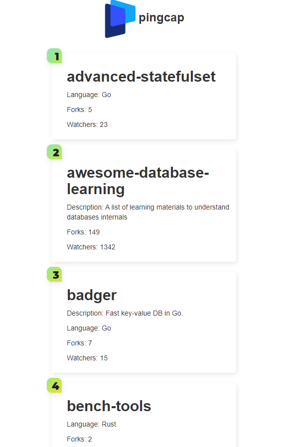

# Git-Viewer

This application is a github viewer, it helps to view github contributors, and can also sort contributors by pull requests or contributions. 

## Search Page

Simply enter the git owner in the search bar. 

## Repo Page

It shows a list of all repos by alphabetical order. And you can view contributors by clicking that repo.

## User Page

User page displays contributors, order by the number of either contributions or pull requests. 

* Order by contributions

* Order by pull requests

